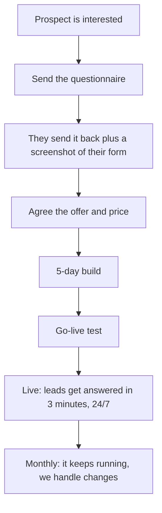
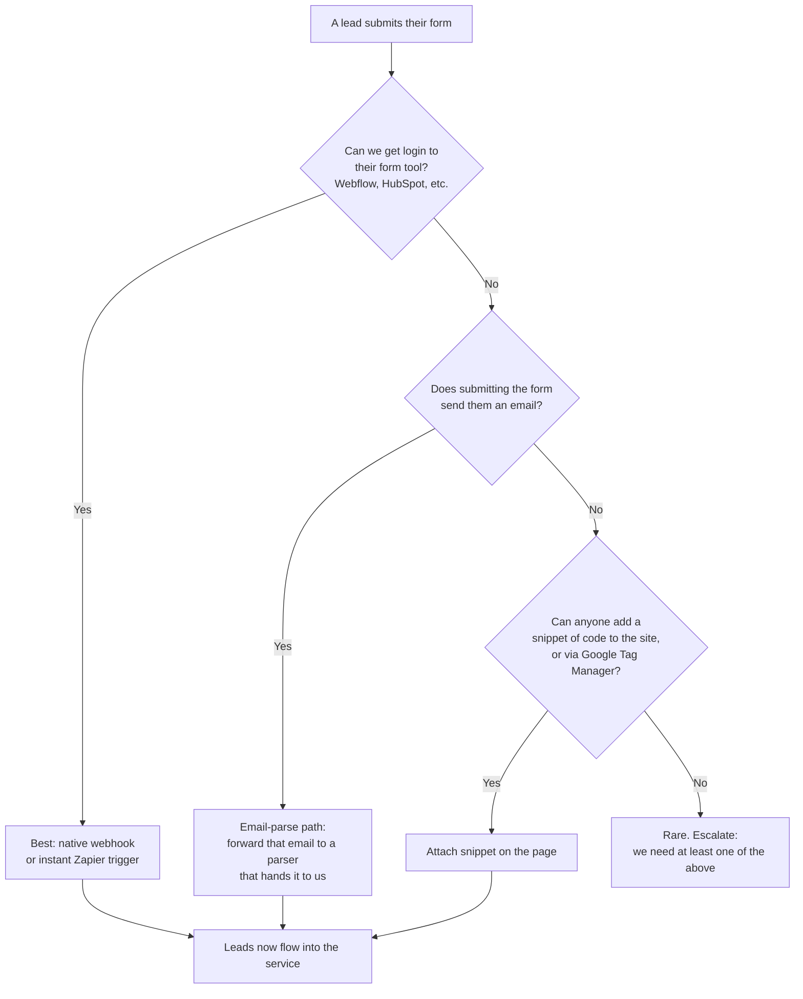
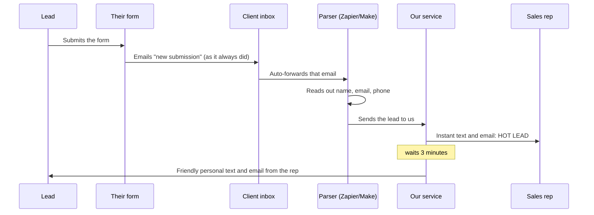
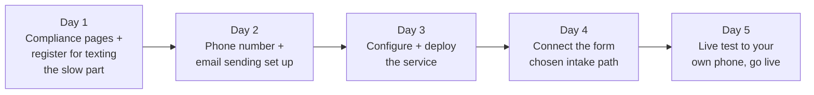

# How This Service Works, Start to Finish

A plain-English map of the whole journey, from "interested prospect" to "system is live and booking calls." Written to be read by a non-technical person. The diagrams below render automatically on GitHub.

If a term is unfamiliar, there's a glossary at the bottom.

---

## The one-sentence version

A prospect's website form already collects leads. We add an invisible layer on top: the moment a lead comes in, the client's sales rep gets an instant text and email, and the lead gets a friendly personal reply within 3 minutes, day or night. We never touch the client's website.

---

## The big picture

**What each stage means:**

1. **Prospect is interested** — a CDMO business-development team that gets website leads but is slow to respond to them.
2. **Send the questionnaire** — `docs/INTAKE-QUESTIONNAIRE.md`. It collects everything the build needs.
3. **They send it back** — plus a screenshot of their contact form and, ideally, one real example of the notification email they get when someone submits.
4. **Agree the offer and price** — the guarantee and pricing. The internal playbook for this is `docs/GUARANTEE.md` (not in this public repo).
5. **5-day build** — the technical setup. Detailed below. You mostly hand off to the implementer here.
6. **Go-live test** — we submit a fake lead using your own phone and email and watch it all fire in seconds.
7. **Live** — every real lead now gets answered instantly.
8. **Monthly** — it runs on its own; changes like "new rep" or "new hours" are a quick config edit.

---

## The trickiest part, made simple: how leads reach us

The service needs to *hear about* each lead the instant it happens. How we connect depends on what access the client can give. This is the one decision that changes per client, so here it is as a decision tree.

**In plain words:**

- **If they can log into their form tool** (or hand it to us), that tool can "webhook" the lead straight to us. Cleanest, fastest, free.
- **If not, but the form emails them** when someone submits (almost always true) — they forward that email to a small robot inbox that reads out the name, email, and phone and passes it to us. Zero website access needed. This is the workhorse for locked-down clients. Full steps: `docs/EMAIL-PARSE-SETUP.md`.
- **If neither, but someone can add a bit of code** to the site (directly or through Google Tag Manager, which marketing teams often control) — we use the attach snippet. Steps: `integration-kit/README.md`.
- **If truly none of the above** — rare. Flag it; we can't run without at least one path in.

**The key message for your pitch:** "no website access" is not a blocker. If they can forward one email, we're in.

---

## The email-parse path, drawn out

Since this is the most common path for a locked-down client, here's what actually happens to a single lead:

The client's inbox, form, and CRM behave exactly as before. We're just listening.

---

## The 5-day build (what the implementer does)

You hand off after the questionnaire; this is the technical track so you know what "in progress" looks like.

- **Day 1 is the critical one.** To send texts legally in the US, the business must be registered with the phone carriers ("A2P"). Approval can take days to weeks, so it's submitted first and everything else happens while we wait. The questionnaire's business details (legal name, EIN) feed this.
- **Days 2 to 4** are mechanical: get a phone number, set up email sending, put the service online, connect the lead path.
- **Day 5** is the proof: submit a test lead through their real form using your phone, watch the rep alert and the follow-up arrive in seconds.

Full checklist: `docs/RUNBOOK.md`.

---

## What you need to collect from the client

Everything is in the questionnaire, but the three that actually unblock the build:

1. **What their form is built with** — or, if they don't know, the email of whoever manages their website/marketing tech.
2. **A real example of their form's notification email** — this one artifact usually unlocks the whole email-parse path with no other access.
3. **Legal business details** (name, EIN, address) — needed to register for texting on Day 1.

---

## What "live and working" looks like

- A real lead submits the client's form.
- Within seconds, every sales rep gets a text and email with the lead's name and number.
- Within 3 minutes, the lead gets a warm, personal-sounding text and email — worded for the time of day (a 2pm lead hears "I'll call you right after this call"; a 9pm lead hears "I'll reach out first thing tomorrow").
- Every lead is logged as a backup, in case their own system ever drops one.
- It runs 24/7 with no one touching it.

That gap — instant instead of "sometime tomorrow" — is the entire product, and it's what the guarantee is built on.

---

## Glossary

- **Lead** — someone who filled out the contact form.
- **CDMO** — the pharma manufacturing companies we sell this to.
- **A2P / registration for texting** — the legal approval to send business texts in the US. Done once per client, Day 1, can be slow.
- **Webhook** — an automatic "ping" one tool sends another the instant something happens. How a form tool tells us about a lead.
- **Zapier / Make** — no-code tools that connect apps. We use them to catch a lead (often from an email) and pass it to our service.
- **The service / microservice** — the small program we run for each client that does the alerting and follow-ups.
- **Field map** — our translation table so we understand a form no matter what it calls its fields ("Name", "your-name", "fullName" all become the lead's name).
- **Simulation mode** — a test mode that prints what it *would* send without actually texting anyone. Used to check the setup safely.
